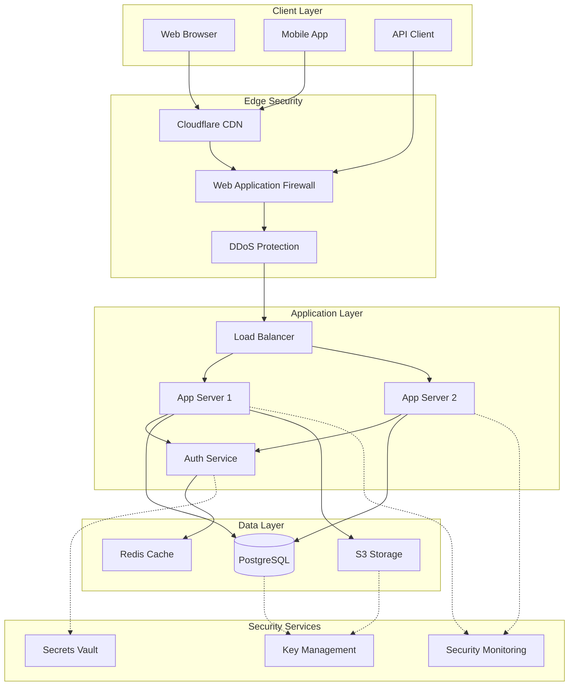

# WebUredno Phase 2 Security Implementation Plan

## Executive Summary

**Current Risk Level**: 🔴 **CRITICAL**
**Target Risk Level**: 🟢 **LOW**
**Implementation Timeline**: 4 weeks
**Compliance Target**: GDPR & Croatian Legal Requirements
**Production Readiness Date**: Week 5

### Critical Security Gaps Identified
1. No authentication system for admin portal
2. Missing GDPR cookie consent implementation
3. Incomplete API security measures
4. Absent data encryption for PII
5. No security monitoring or incident response

---

## 1. Authentication & Authorization System

### 1.1 Admin Portal Authentication

#### Implementation Architecture
```typescript
// Architecture Components
┌─────────────────┐     ┌──────────────────┐     ┌───────────────┐
│   Admin Login   │────▶│  Auth Middleware │────▶│  Admin Portal │
└─────────────────┘     └──────────────────┘     └───────────────┘
         │                       │                         │
         ▼                       ▼                         ▼
┌─────────────────┐     ┌──────────────────┐     ┌───────────────┐
│   JWT Service   │     │  Session Store   │     │   Audit Log   │
└─────────────────┘     └──────────────────┘     └───────────────┘
```

#### JWT Implementation
```typescript
// lib/auth/jwt.ts
import jwt from 'jsonwebtoken';
import { createHash, randomBytes } from 'crypto';

export class JWTService {
  private static readonly ACCESS_TOKEN_EXPIRY = '15m';
  private static readonly REFRESH_TOKEN_EXPIRY = '7d';
  private static readonly TOKEN_ALGORITHM = 'HS256';

  static generateTokenPair(userId: string, role: UserRole) {
    const jti = randomBytes(16).toString('hex');

    const accessToken = jwt.sign(
      {
        sub: userId,
        role,
        type: 'access',
        jti
      },
      process.env.JWT_SECRET!,
      {
        algorithm: this.TOKEN_ALGORITHM,
        expiresIn: this.ACCESS_TOKEN_EXPIRY
      }
    );

    const refreshToken = jwt.sign(
      {
        sub: userId,
        type: 'refresh',
        jti: createHash('sha256').update(jti).digest('hex')
      },
      process.env.JWT_REFRESH_SECRET!,
      {
        algorithm: this.TOKEN_ALGORITHM,
        expiresIn: this.REFRESH_TOKEN_EXPIRY
      }
    );

    return { accessToken, refreshToken, jti };
  }

  static async validateToken(token: string, type: 'access' | 'refresh') {
    const secret = type === 'access'
      ? process.env.JWT_SECRET
      : process.env.JWT_REFRESH_SECRET;

    try {
      const payload = jwt.verify(token, secret!) as JWTPayload;

      // Check token blacklist
      if (await this.isTokenBlacklisted(payload.jti)) {
        throw new Error('Token has been revoked');
      }

      return payload;
    } catch (error) {
      throw new UnauthorizedError('Invalid token');
    }
  }
}
```

### 1.2 Role-Based Access Control (RBAC)

#### Role Hierarchy
```yaml
Roles:
  SUPER_ADMIN:
    - All permissions
    - User management
    - System configuration

  ADMIN:
    - Booking management
    - Team management
    - Customer data access
    - Reports viewing

  TEAM_LEAD:
    - Team schedule management
    - Booking assignment
    - Quality checklist review

  CLEANER:
    - View assigned bookings
    - Update booking status
    - Submit quality checklist
```

#### Permission Matrix
| Feature | Super Admin | Admin | Team Lead | Cleaner |
|---------|------------|-------|-----------|---------|
| User Management | ✅ | ❌ | ❌ | ❌ |
| Booking CRUD | ✅ | ✅ | Read | Read |
| Team Management | ✅ | ✅ | ✅ | ❌ |
| Financial Data | ✅ | ✅ | ❌ | ❌ |
| Customer PII | ✅ | ✅ | Limited | ❌ |
| System Config | ✅ | ❌ | ❌ | ❌ |

### 1.3 Session Management

```typescript
// lib/auth/session.ts
export class SessionManager {
  private static readonly SESSION_DURATION = 30 * 60 * 1000; // 30 minutes
  private static readonly MAX_SESSIONS_PER_USER = 3;

  static async createSession(userId: string, deviceInfo: DeviceInfo) {
    // Enforce session limit
    const activeSessions = await this.getActiveSessions(userId);
    if (activeSessions.length >= this.MAX_SESSIONS_PER_USER) {
      await this.revokeOldestSession(userId);
    }

    const sessionId = randomBytes(32).toString('hex');
    const session = {
      id: sessionId,
      userId,
      deviceInfo,
      createdAt: new Date(),
      expiresAt: new Date(Date.now() + this.SESSION_DURATION),
      lastActivity: new Date()
    };

    await redis.setex(
      `session:${sessionId}`,
      this.SESSION_DURATION / 1000,
      JSON.stringify(session)
    );

    return sessionId;
  }

  static async validateSession(sessionId: string) {
    const session = await redis.get(`session:${sessionId}`);

    if (!session) {
      throw new UnauthorizedError('Session expired');
    }

    // Update last activity
    await this.touchSession(sessionId);

    return JSON.parse(session);
  }
}
```

---

## 2. Data Protection Implementation

### 2.1 Encryption Architecture

```yaml
Encryption Strategy:
  At Rest:
    - Database: AES-256-GCM for PII fields
    - File Storage: Encrypted S3 buckets
    - Backups: Encrypted with separate key

  In Transit:
    - TLS 1.3 minimum
    - Certificate pinning for mobile apps
    - Perfect Forward Secrecy enabled

  Key Management:
    - AWS KMS for production
    - Key rotation every 90 days
    - Separate keys for different data types
```

### 2.2 PII Field Encryption

```typescript
// lib/encryption/pii.ts
import { createCipheriv, createDecipheriv, randomBytes } from 'crypto';

export class PIIEncryption {
  private static readonly ALGORITHM = 'aes-256-gcm';
  private static readonly KEY = Buffer.from(process.env.ENCRYPTION_KEY!, 'hex');

  static encrypt(text: string): EncryptedData {
    const iv = randomBytes(16);
    const cipher = createCipheriv(this.ALGORITHM, this.KEY, iv);

    let encrypted = cipher.update(text, 'utf8', 'hex');
    encrypted += cipher.final('hex');

    const authTag = cipher.getAuthTag();

    return {
      data: encrypted,
      iv: iv.toString('hex'),
      authTag: authTag.toString('hex')
    };
  }

  static decrypt(encryptedData: EncryptedData): string {
    const decipher = createDecipheriv(
      this.ALGORITHM,
      this.KEY,
      Buffer.from(encryptedData.iv, 'hex')
    );

    decipher.setAuthTag(Buffer.from(encryptedData.authTag, 'hex'));

    let decrypted = decipher.update(encryptedData.data, 'hex', 'utf8');
    decrypted += decipher.final('utf8');

    return decrypted;
  }
}

// Prisma middleware for automatic encryption
prisma.$use(async (params, next) => {
  const piiFields = ['email', 'phone', 'firstName', 'lastName'];

  if (params.model === 'Customer' && params.action === 'create') {
    piiFields.forEach(field => {
      if (params.args.data[field]) {
        params.args.data[field] = PIIEncryption.encrypt(params.args.data[field]);
      }
    });
  }

  const result = await next(params);

  if (params.model === 'Customer' && params.action.startsWith('find')) {
    // Decrypt on read
    if (result) {
      const decryptCustomer = (customer: any) => {
        piiFields.forEach(field => {
          if (customer[field]) {
            customer[field] = PIIEncryption.decrypt(customer[field]);
          }
        });
      };

      Array.isArray(result)
        ? result.forEach(decryptCustomer)
        : decryptCustomer(result);
    }
  }

  return result;
});
```

### 2.3 Data Masking & Anonymization

```typescript
// lib/privacy/masking.ts
export class DataMasking {
  static maskEmail(email: string): string {
    const [local, domain] = email.split('@');
    const maskedLocal = local.slice(0, 2) + '***';
    return `${maskedLocal}@${domain}`;
  }

  static maskPhone(phone: string): string {
    return phone.slice(0, 4) + '****' + phone.slice(-2);
  }

  static maskName(name: string): string {
    return name[0] + '*'.repeat(name.length - 1);
  }

  static anonymizeForAnalytics(customer: Customer): AnonymizedCustomer {
    return {
      id: createHash('sha256').update(customer.id).digest('hex'),
      postalCode: customer.addresses[0]?.postalCode,
      language: customer.language,
      bookingCount: customer.bookings.length,
      joinMonth: customer.createdAt.toISOString().slice(0, 7)
    };
  }
}
```

### 2.4 GDPR Compliance Implementation

#### Cookie Consent System
```typescript
// components/gdpr/CookieConsentManager.tsx
export const CookieConsentManager = () => {
  const [consent, setConsent] = useState<ConsentState>({
    necessary: true,
    functional: false,
    analytics: false,
    marketing: false
  });

  const handleConsent = async (newConsent: ConsentState) => {
    // Store consent with timestamp
    const consentRecord = {
      ...newConsent,
      timestamp: new Date().toISOString(),
      ipAddress: await getAnonymizedIP(),
      userAgent: navigator.userAgent
    };

    // Save to database for audit trail
    await api.post('/api/gdpr/consent', consentRecord);

    // Update cookie settings
    if (newConsent.analytics) {
      enableGoogleAnalytics();
    } else {
      disableGoogleAnalytics();
    }
  };

  return (
    <div className="cookie-consent-banner">
      <h3>Upravljanje Kolačićima</h3>

      <div className="consent-categories">
        <ConsentCategory
          name="Nužni kolačići"
          description="Omogućavaju osnovne funkcionalnosti web stranice"
          mandatory={true}
          checked={consent.necessary}
        />

        <ConsentCategory
          name="Funkcionalni kolačići"
          description="Pamte vaše postavke i preferencije"
          checked={consent.functional}
          onChange={(checked) => setConsent({...consent, functional: checked})}
        />

        <ConsentCategory
          name="Analitički kolačići"
          description="Pomažu nam poboljšati web stranicu"
          checked={consent.analytics}
          onChange={(checked) => setConsent({...consent, analytics: checked})}
        />

        <ConsentCategory
          name="Marketinški kolačići"
          description="Omogućavaju prilagođene oglase"
          checked={consent.marketing}
          onChange={(checked) => setConsent({...consent, marketing: checked})}
        />
      </div>

      <div className="consent-actions">
        <button onClick={() => handleConsent(consent)}>
          Spremi postavke
        </button>
        <button onClick={() => handleConsent({
          necessary: true,
          functional: true,
          analytics: true,
          marketing: true
        })}>
          Prihvati sve
        </button>
      </div>
    </div>
  );
};
```

#### Data Retention Policies
```typescript
// services/dataRetention.ts
export class DataRetentionService {
  static readonly RETENTION_POLICIES = {
    bookings: { months: 24, reason: 'Service history and warranty' },
    customerData: { months: 36, reason: 'Legal requirement' },
    financialRecords: { months: 84, reason: 'Tax compliance (7 years)' },
    auditLogs: { months: 12, reason: 'Security monitoring' },
    marketingConsent: { months: 24, reason: 'Consent validity' },
    anonymousAnalytics: { months: 36, reason: 'Business intelligence' }
  };

  static async enforceRetentionPolicies() {
    for (const [dataType, policy] of Object.entries(this.RETENTION_POLICIES)) {
      const cutoffDate = new Date();
      cutoffDate.setMonth(cutoffDate.getMonth() - policy.months);

      switch (dataType) {
        case 'bookings':
          await this.archiveOldBookings(cutoffDate);
          break;
        case 'customerData':
          await this.anonymizeInactiveCustomers(cutoffDate);
          break;
        case 'auditLogs':
          await this.purgeOldAuditLogs(cutoffDate);
          break;
      }
    }
  }

  private static async anonymizeInactiveCustomers(cutoffDate: Date) {
    const inactiveCustomers = await prisma.customer.findMany({
      where: {
        updatedAt: { lt: cutoffDate },
        bookings: { none: { createdAt: { gte: cutoffDate } } }
      }
    });

    for (const customer of inactiveCustomers) {
      await prisma.customer.update({
        where: { id: customer.id },
        data: {
          email: `anonymized_${customer.id}@deleted.com`,
          firstName: 'ANONYMIZED',
          lastName: 'USER',
          phone: '000000000',
          gdprConsent: false,
          marketingConsent: false
        }
      });
    }
  }
}
```

---

## 3. API Security Implementation

### 3.1 Rate Limiting Strategy

```typescript
// lib/security/rateLimiter.ts
import Redis from 'ioredis';

export class RateLimiter {
  private static redis = new Redis(process.env.REDIS_URL!);

  static readonly LIMITS = {
    '/api/booking': { requests: 10, window: 60 },        // 10 per minute
    '/api/admin': { requests: 100, window: 60 },         // 100 per minute
    '/api/auth/login': { requests: 5, window: 300 },     // 5 per 5 minutes
    '/api/gdpr': { requests: 5, window: 3600 },          // 5 per hour
    'default': { requests: 60, window: 60 }              // 60 per minute
  };

  static async checkLimit(
    identifier: string,
    endpoint: string
  ): Promise<RateLimitResult> {
    const limit = this.LIMITS[endpoint] || this.LIMITS.default;
    const key = `rate:${endpoint}:${identifier}`;

    const pipe = this.redis.pipeline();
    const now = Date.now();
    const window = now - (limit.window * 1000);

    // Remove old entries
    pipe.zremrangebyscore(key, '-inf', window);

    // Count current entries
    pipe.zcard(key);

    // Add current request
    pipe.zadd(key, now, `${now}-${Math.random()}`);

    // Set expiry
    pipe.expire(key, limit.window + 1);

    const results = await pipe.exec();
    const count = results[1][1] as number;

    return {
      allowed: count < limit.requests,
      remaining: Math.max(0, limit.requests - count - 1),
      resetAt: new Date(now + (limit.window * 1000))
    };
  }
}

// Middleware implementation
export async function rateLimitMiddleware(
  req: NextApiRequest,
  res: NextApiResponse
) {
  const identifier = req.headers['x-forwarded-for'] ||
                    req.socket.remoteAddress ||
                    'unknown';

  const result = await RateLimiter.checkLimit(
    identifier,
    req.url!
  );

  res.setHeader('X-RateLimit-Remaining', result.remaining);
  res.setHeader('X-RateLimit-Reset', result.resetAt.toISOString());

  if (!result.allowed) {
    return res.status(429).json({
      error: 'Too many requests',
      retryAfter: result.resetAt
    });
  }
}
```

### 3.2 API Key Management

```typescript
// lib/security/apiKey.ts
export class APIKeyManager {
  static async generateKey(
    clientId: string,
    permissions: string[]
  ): Promise<APIKey> {
    const key = `wbu_${randomBytes(32).toString('hex')}`;
    const hashedKey = createHash('sha256').update(key).digest('hex');

    const apiKey = await prisma.apiKey.create({
      data: {
        clientId,
        keyHash: hashedKey,
        prefix: key.substring(0, 8),
        permissions,
        expiresAt: new Date(Date.now() + 365 * 24 * 60 * 60 * 1000),
        lastUsed: null
      }
    });

    return {
      id: apiKey.id,
      key: key, // Only returned once
      expiresAt: apiKey.expiresAt
    };
  }

  static async validateKey(key: string): Promise<APIKeyValidation> {
    const hashedKey = createHash('sha256').update(key).digest('hex');

    const apiKey = await prisma.apiKey.findFirst({
      where: {
        keyHash: hashedKey,
        isActive: true,
        expiresAt: { gte: new Date() }
      }
    });

    if (!apiKey) {
      throw new UnauthorizedError('Invalid API key');
    }

    // Update last used
    await prisma.apiKey.update({
      where: { id: apiKey.id },
      data: { lastUsed: new Date() }
    });

    return {
      clientId: apiKey.clientId,
      permissions: apiKey.permissions
    };
  }
}
```

### 3.3 Request Validation & Sanitization

```typescript
// lib/security/validation.ts
import DOMPurify from 'isomorphic-dompurify';
import { z } from 'zod';

export class RequestValidator {
  // SQL injection prevention
  static sanitizeSQL(input: string): string {
    return input
      .replace(/['";\\]/g, '')
      .replace(/--/g, '')
      .replace(/\/\*/g, '')
      .replace(/\*\//g, '');
  }

  // XSS prevention
  static sanitizeHTML(input: string): string {
    return DOMPurify.sanitize(input, {
      ALLOWED_TAGS: [],
      ALLOWED_ATTR: []
    });
  }

  // Path traversal prevention
  static sanitizePath(path: string): string {
    return path
      .replace(/\.\./g, '')
      .replace(/[^a-zA-Z0-9\-_\/]/g, '');
  }

  // Input validation schemas
  static readonly schemas = {
    booking: z.object({
      serviceType: z.enum(['STANDARD', 'STANDARD_PLUS', 'DEEP_CLEAN']),
      scheduledDate: z.string().datetime(),
      customerEmail: z.string().email(),
      address: z.object({
        street: z.string().min(1).max(200),
        city: z.string().min(1).max(100),
        postalCode: z.string().regex(/^\d{5}$/)
      }),
      specialInstructions: z.string().max(500).optional()
    }),

    gdprRequest: z.object({
      type: z.enum(['ACCESS', 'DELETE', 'PORTABILITY', 'RECTIFY']),
      email: z.string().email(),
      verificationToken: z.string().length(64)
    })
  };

  static async validateRequest(
    schema: z.ZodSchema,
    data: unknown
  ): Promise<any> {
    try {
      return await schema.parseAsync(data);
    } catch (error) {
      if (error instanceof z.ZodError) {
        throw new ValidationError(error.errors);
      }
      throw error;
    }
  }
}
```

### 3.4 CSRF Protection

```typescript
// lib/security/csrf.ts
export class CSRFProtection {
  private static readonly TOKEN_LENGTH = 32;
  private static readonly TOKEN_EXPIRY = 60 * 60 * 1000; // 1 hour

  static generateToken(sessionId: string): string {
    const token = randomBytes(this.TOKEN_LENGTH).toString('hex');
    const hash = createHash('sha256')
      .update(token + sessionId)
      .digest('hex');

    // Store in Redis with expiry
    redis.setex(
      `csrf:${sessionId}`,
      this.TOKEN_EXPIRY / 1000,
      hash
    );

    return token;
  }

  static async validateToken(
    token: string,
    sessionId: string
  ): Promise<boolean> {
    const storedHash = await redis.get(`csrf:${sessionId}`);

    if (!storedHash) {
      return false;
    }

    const tokenHash = createHash('sha256')
      .update(token + sessionId)
      .digest('hex');

    // Timing-safe comparison
    return timingSafeEqual(
      Buffer.from(storedHash),
      Buffer.from(tokenHash)
    );
  }
}

// Double Submit Cookie Pattern
export function csrfMiddleware(handler: NextApiHandler): NextApiHandler {
  return async (req, res) => {
    if (['POST', 'PUT', 'DELETE', 'PATCH'].includes(req.method!)) {
      const headerToken = req.headers['x-csrf-token'];
      const cookieToken = req.cookies['csrf-token'];

      if (!headerToken || !cookieToken || headerToken !== cookieToken) {
        return res.status(403).json({ error: 'Invalid CSRF token' });
      }
    }

    return handler(req, res);
  };
}
```

---

## 4. Infrastructure Security

### 4.1 WAF Configuration

```yaml
# AWS WAF Rules Configuration
WebACL:
  DefaultAction: ALLOW

  Rules:
    - Name: RateLimitRule
      Priority: 1
      Statement:
        RateBasedStatement:
          Limit: 2000
          AggregateKeyType: IP
      Action: BLOCK

    - Name: SQLiRule
      Priority: 2
      Statement:
        SqlInjectionMatchStatement:
          FieldToMatch:
            AllQueryArguments: {}
          TextTransformations:
            - Priority: 0
              Type: URL_DECODE
            - Priority: 1
              Type: HTML_ENTITY_DECODE
      Action: BLOCK

    - Name: XSSRule
      Priority: 3
      Statement:
        CrossSiteScriptingMatchStatement:
          FieldToMatch:
            Body: {}
          TextTransformations:
            - Priority: 0
              Type: NONE
      Action: BLOCK

    - Name: GeoBlockingRule
      Priority: 4
      Statement:
        GeoMatchStatement:
          CountryCodes:
            - CN
            - RU
            - KP
      Action: BLOCK

    - Name: IPReputationList
      Priority: 5
      Statement:
        IPSetReferenceStatement:
          ARN: arn:aws:wafv2:eu-central-1:account:ipset/malicious-ips
      Action: BLOCK
```

### 4.2 DDoS Protection Strategy

```typescript
// lib/security/ddos.ts
export class DDoSProtection {
  static readonly THRESHOLDS = {
    requestsPerIP: 100,           // Per minute
    uniqueIPsPerMinute: 1000,     // Alert threshold
    totalRequestsPerMinute: 10000, // Circuit breaker
    payloadSizeLimit: 10485760    // 10MB
  };

  static async detectAnomaly(metrics: TrafficMetrics): Promise<AnomalyResult> {
    const anomalies = [];

    // Check request rate
    if (metrics.requestsPerMinute > this.THRESHOLDS.totalRequestsPerMinute) {
      anomalies.push({
        type: 'HIGH_REQUEST_RATE',
        severity: 'CRITICAL',
        value: metrics.requestsPerMinute
      });
    }

    // Check unique IPs
    if (metrics.uniqueIPs > this.THRESHOLDS.uniqueIPsPerMinute) {
      anomalies.push({
        type: 'IP_SURGE',
        severity: 'HIGH',
        value: metrics.uniqueIPs
      });
    }

    // Check payload sizes
    if (metrics.avgPayloadSize > this.THRESHOLDS.payloadSizeLimit) {
      anomalies.push({
        type: 'LARGE_PAYLOAD',
        severity: 'MEDIUM',
        value: metrics.avgPayloadSize
      });
    }

    return {
      detected: anomalies.length > 0,
      anomalies,
      recommendation: this.getRecommendation(anomalies)
    };
  }

  static async enableCircuitBreaker(): Promise<void> {
    // Switch to static cached responses
    await redis.set('circuit_breaker', 'open', 'EX', 300);

    // Alert operations team
    await this.sendAlert({
      level: 'CRITICAL',
      message: 'DDoS protection circuit breaker activated',
      action: 'Serving cached responses for 5 minutes'
    });

    // Enable Cloudflare Under Attack Mode
    await this.enableCloudflareUAM();
  }
}
```

### 4.3 Security Monitoring & Alerting

```typescript
// lib/monitoring/security.ts
export class SecurityMonitor {
  static readonly ALERT_CHANNELS = {
    email: ['security@weburedno.hr'],
    slack: process.env.SLACK_SECURITY_WEBHOOK,
    pagerduty: process.env.PAGERDUTY_KEY
  };

  static readonly MONITORING_RULES = [
    {
      name: 'Failed Login Attempts',
      threshold: 5,
      window: 300,
      severity: 'HIGH',
      action: 'BLOCK_IP'
    },
    {
      name: 'SQL Injection Attempts',
      threshold: 1,
      window: 60,
      severity: 'CRITICAL',
      action: 'BLOCK_AND_ALERT'
    },
    {
      name: 'Unauthorized Admin Access',
      threshold: 1,
      window: 1,
      severity: 'CRITICAL',
      action: 'IMMEDIATE_ALERT'
    },
    {
      name: 'Data Export Requests',
      threshold: 10,
      window: 3600,
      severity: 'MEDIUM',
      action: 'LOG_AND_REVIEW'
    }
  ];

  static async logSecurityEvent(event: SecurityEvent): Promise<void> {
    // Store in time-series database
    await influx.writePoints([
      {
        measurement: 'security_events',
        tags: {
          type: event.type,
          severity: event.severity,
          source: event.source
        },
        fields: {
          details: JSON.stringify(event.details),
          userId: event.userId,
          ip: event.ip
        },
        timestamp: event.timestamp
      }
    ]);

    // Check if alert needed
    const rule = this.MONITORING_RULES.find(r => r.name === event.type);
    if (rule) {
      await this.checkThresholdAndAlert(event, rule);
    }
  }

  static async generateSecurityReport(): Promise<SecurityReport> {
    const endDate = new Date();
    const startDate = new Date(endDate.getTime() - 24 * 60 * 60 * 1000);

    const events = await influx.query(`
      SELECT count(*) as count
      FROM security_events
      WHERE time >= '${startDate.toISOString()}'
      GROUP BY type, severity
    `);

    return {
      period: { start: startDate, end: endDate },
      summary: {
        total: events.reduce((sum, e) => sum + e.count, 0),
        critical: events.filter(e => e.severity === 'CRITICAL').length,
        high: events.filter(e => e.severity === 'HIGH').length,
        medium: events.filter(e => e.severity === 'MEDIUM').length
      },
      topThreats: this.identifyTopThreats(events),
      recommendations: this.generateRecommendations(events)
    };
  }
}
```

### 4.4 Incident Response Procedures

```yaml
# Incident Response Playbook

Level 1 - Low Impact:
  Detection: Automated monitoring alert
  Response Time: 1 hour
  Actions:
    - Review logs
    - Assess impact
    - Document incident
  Team: On-call engineer

Level 2 - Medium Impact:
  Detection: Multiple alerts or user reports
  Response Time: 30 minutes
  Actions:
    - Immediate assessment
    - Containment measures
    - Stakeholder notification
    - Root cause analysis
  Team: Security team + Engineering lead

Level 3 - High Impact:
  Detection: Critical security breach
  Response Time: 15 minutes
  Actions:
    - Immediate containment
    - Executive notification
    - External security team engagement
    - Legal counsel involvement
    - Customer communication plan
  Team: Full incident response team

Post-Incident:
  - Incident report within 24 hours
  - Post-mortem within 72 hours
  - Security improvements implementation
  - Training updates if needed
  - Compliance reporting if required
```

---

## Security Architecture Diagram



---

## GDPR Compliance Checklist

### Legal Basis & Documentation
- [ ] Privacy Policy in Croatian and English
- [ ] Terms of Service with GDPR clauses
- [ ] Data Processing Register maintained
- [ ] Lawful basis documented for each processing activity
- [ ] Third-party processor agreements in place
- [ ] Data Protection Impact Assessment completed

### Technical Implementation
- [ ] Cookie consent banner before any tracking
- [ ] Granular consent management system
- [ ] Data export functionality (JSON/CSV)
- [ ] Data deletion automation
- [ ] Data portability API
- [ ] Consent audit trail in database
- [ ] Encryption for all PII data
- [ ] Pseudonymization for analytics

### Data Subject Rights
- [ ] Right to Access implementation
- [ ] Right to Erasure (Right to be Forgotten)
- [ ] Right to Rectification
- [ ] Right to Data Portability
- [ ] Right to Restrict Processing
- [ ] Right to Object
- [ ] Rights related to automated decision making
- [ ] Right to withdraw consent

### Organizational Measures
- [ ] Data Protection Officer appointed (if required)
- [ ] Staff GDPR training completed
- [ ] Breach notification procedure (72 hours)
- [ ] Regular privacy audits scheduled
- [ ] Vendor compliance verification
- [ ] Cross-border transfer safeguards

---

## Croatian Regulatory Requirements

### Business Compliance
- [ ] Company registration with Croatian Commercial Court
- [ ] Tax registration (OIB number)
- [ ] VAT registration (if applicable)
- [ ] Business liability insurance
- [ ] Professional indemnity insurance

### Consumer Protection (Zakon o zaštiti potrošača)
- [ ] Clear pricing display with VAT
- [ ] 14-day withdrawal right for consumers
- [ ] Complaint handling procedure
- [ ] Terms clearly visible before purchase
- [ ] Contact information prominently displayed

### Electronic Commerce (Zakon o elektroničkoj trgovini)
- [ ] Company details on website (name, address, OIB)
- [ ] Clear order process with confirmation
- [ ] Electronic invoicing capability
- [ ] Data retention for tax purposes (7 years)
- [ ] Secure payment processing

### Labor Law Compliance
- [ ] Employment contracts for cleaners
- [ ] Work safety training documentation
- [ ] Health and safety equipment provision
- [ ] Working time records
- [ ] Minimum wage compliance

---

## 4-Week Security Hardening Plan

### Week 1: Critical Security Foundation
**Monday-Tuesday**
- [ ] Implement admin authentication system
- [ ] Deploy JWT service with refresh tokens
- [ ] Setup session management with Redis
- [ ] Create admin login UI

**Wednesday-Thursday**
- [ ] Implement RBAC system
- [ ] Add permission middleware
- [ ] Setup audit logging
- [ ] Create user management interface

**Friday**
- [ ] Security testing of auth system
- [ ] Penetration testing basics
- [ ] Documentation update
- [ ] Team training on new auth

### Week 2: Data Protection & GDPR
**Monday-Tuesday**
- [ ] Implement PII encryption
- [ ] Setup encryption key management
- [ ] Add data masking utilities
- [ ] Create anonymization service

**Wednesday-Thursday**
- [ ] Deploy cookie consent system
- [ ] Implement consent tracking
- [ ] Create privacy policy page
- [ ] Add GDPR rights portal

**Friday**
- [ ] Data retention automation
- [ ] GDPR compliance testing
- [ ] Legal review of privacy policy
- [ ] Customer communication prep

### Week 3: API & Infrastructure Security
**Monday-Tuesday**
- [ ] Enhanced rate limiting implementation
- [ ] API key management system
- [ ] Request validation middleware
- [ ] Input sanitization library

**Wednesday-Thursday**
- [ ] Complete CSRF protection
- [ ] WAF configuration deployment
- [ ] DDoS protection setup
- [ ] Security headers verification

**Friday**
- [ ] API security testing
- [ ] Load testing with rate limits
- [ ] Security monitoring setup
- [ ] Alert configuration

### Week 4: Monitoring & Compliance
**Monday-Tuesday**
- [ ] Security event logging system
- [ ] SIEM integration
- [ ] Real-time alerting setup
- [ ] Dashboard creation

**Wednesday-Thursday**
- [ ] Incident response procedures
- [ ] Security playbook documentation
- [ ] Team training on procedures
- [ ] Emergency contact list

**Friday**
- [ ] Final security audit
- [ ] Compliance verification
- [ ] Production readiness review
- [ ] Go-live preparation

---

## Security Testing Procedures

### 1. Authentication Testing
```bash
# Test JWT implementation
curl -X POST https://api.weburedno.hr/auth/login \
  -H "Content-Type: application/json" \
  -d '{"email":"admin@weburedno.hr","password":"test"}'

# Test token refresh
curl -X POST https://api.weburedno.hr/auth/refresh \
  -H "Authorization: Bearer [refresh_token]"

# Test RBAC
curl -X GET https://api.weburedno.hr/admin/users \
  -H "Authorization: Bearer [access_token]"
```

### 2. Security Headers Validation
```bash
# Check security headers
curl -I https://weburedno.hr | grep -E "X-Frame-Options|X-Content-Type|CSP"

# Test CSP violations
# Should be blocked by CSP
<script>alert('XSS')</script>
```

### 3. Rate Limiting Test
```bash
# Test rate limiting
for i in {1..100}; do
  curl -X POST https://api.weburedno.hr/booking \
    -H "Content-Type: application/json" \
    -d '{"test":"data"}'
done
```

### 4. GDPR Compliance Test
```bash
# Test data export
curl -X GET https://api.weburedno.hr/gdpr/export \
  -H "Authorization: Bearer [token]"

# Test data deletion
curl -X DELETE https://api.weburedno.hr/gdpr/delete \
  -H "Authorization: Bearer [token]"
```

---

## Security Metrics & KPIs

### Authentication Metrics
- Login success rate: >95%
- Average authentication time: <200ms
- Failed login attempts: <5%
- Token refresh success: >99%
- Session timeout compliance: 100%

### API Security Metrics
- Rate limit false positives: <1%
- API response time (p95): <500ms
- CSRF token validation rate: 100%
- Input validation success: >99%
- API key rotation compliance: 100%

### Data Protection Metrics
- Encryption coverage: 100% of PII
- GDPR request response time: <72 hours
- Consent tracking accuracy: 100%
- Data retention compliance: 100%
- Breach notification time: <72 hours

### Infrastructure Security
- WAF block accuracy: >95%
- DDoS mitigation time: <60 seconds
- Security patch deployment: <24 hours
- Uptime with security measures: >99.9%
- Incident response time: Per SLA levels

---

## Emergency Contacts & Escalation

### Internal Contacts
**Security Lead**: security@weburedno.hr
**CTO**: tin.pavlic@weburedno.hr (+385 92 450 2265)
**Legal Counsel**: legal@weburedno.hr
**Data Protection Officer**: dpo@weburedno.hr

### External Resources
**Croatian DPA**: Agencija za zaštitu osobnih podataka (AZOP)
- Website: azop.hr
- Email: azop@azop.hr
- Phone: +385 1 4609 000

**CERT Croatia**: National CERT
- Website: cert.hr
- Incident reporting: incident@cert.hr
- Phone: +385 1 6165 800

**Emergency Services**
- Police (Cyber Crime): 192
- European emergency: 112

### Escalation Matrix
| Severity | Response Time | Escalation Path |
|----------|--------------|-----------------|
| Low | 1 hour | Engineer → Team Lead |
| Medium | 30 min | Team Lead → CTO |
| High | 15 min | CTO → CEO + Legal |
| Critical | Immediate | All stakeholders + External support |

---

**Implementation Priority**: This plan must be executed in sequence. Week 1 and Week 2 implementations are MANDATORY before production deployment. Failure to implement these security measures exposes the business to significant legal, financial, and reputational risks.

**Next Steps**:
1. Review and approve security implementation plan
2. Allocate resources (2 senior developers, 1 security consultant)
3. Setup development and staging environments for testing
4. Begin Week 1 implementation immediately
5. Schedule security audit for end of Week 4